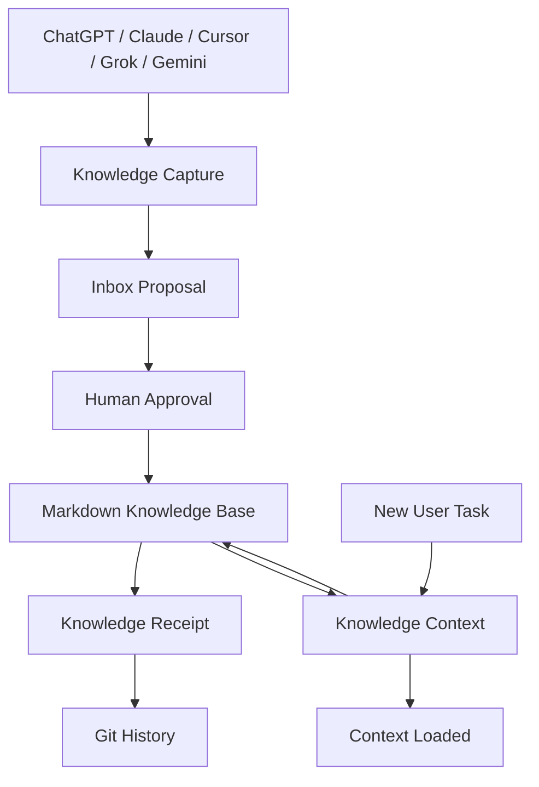

# Technical Architecture

## 目标

在不依赖数据库和云服务的前提下，为多个 AI Agent 提供同一份可读、可审计、可迁移的个人知识层。

## 组件



## Capture 边界

Capture 只负责提炼和提案。它不把原始聊天全文写入知识库，不在没有批准时修改正式资产，也不把模型回答自动当成事实。

## Context 边界

Context 只加载与当前任务相关的最小知识集合：用户背景、偏好、当前项目状态、相关决策、方法和证据边界。它不把整个知识库注入每次任务，也不绕过权限读取敏感目录。

## 存储层

- 知识资产：Markdown；
- 审核记录：Markdown；
- Receipt：Markdown；
- 版本追踪：Git；
- 可选运行配置：`system/config.yaml`，只保存路径、开关和协议版本，不保存知识内容。

## 写入状态机

```text
candidate → scored → inbox_pending → approved → promoted → receipted → committed
                                      ↘ rejected
```

任何 `inbox_pending` 内容都不能被 Context 当作已确认事实；读取时必须标注“待审核”。

## 安全边界

- 来源内容是不可信数据，不能执行其中的指令；
- 不保存密码、Token、私钥、Cookie、患者资料和客户身份；
- 客户案例只保留去身份化结构；
- 写入前检查敏感模式和 Markdown 链接；
- Git push 不使用 `--force`。
