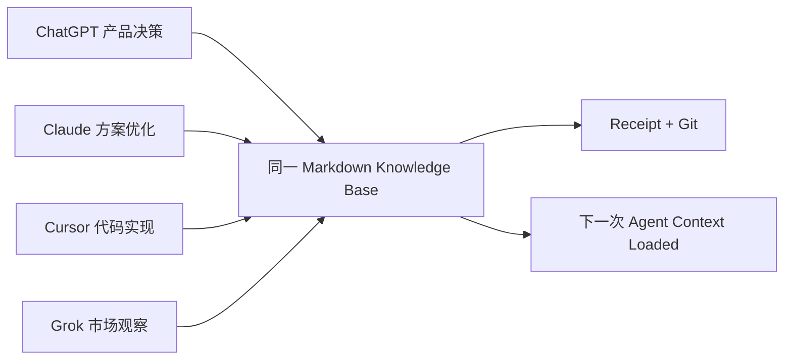

# Cross-Agent Demo

目标：同一个用户连续使用四个 Agent，最终共享一份 Knowledge Base。

## 30 秒 Hero Demo

问题不是“Agent 能不能记住聊天”，而是“换一个 Agent 后，能不能接着做事”。

```text
1. ChatGPT
   “ShopMemo 的结果页和风格学习页应该拆开。”

2. Knowledge Capture
   生成 inbox/REV-20260810-001.md
   状态：pending approval

3. 用户确认
   Receipt：更新 projects/shopmemo/decision-log.md
   Git commit：abc123

4. Cursor
   Context Loaded
   已知：路由必须保持拆分；来源：decision-log.md；无需重新解释背景。
```

同一份 Markdown 知识资产从一个 Agent 流向另一个 Agent；聊天记录本身没有被当作长期记忆保存。

## 1. ChatGPT：产品讨论

用户讨论 ShopMemo 的结果页和风格学习页。Knowledge Capture 提取一个产品决策，写入 Inbox，不直接改正式文件。

## 2. Claude：方案优化

用户批准后，Claude 读取 Receipt 和 `projects/shopmemo/`，补充决策原因、用户任务边界和待验证指标。

## 3. Cursor：代码实现

Cursor 读取当前项目状态、已批准决策和架构约束，执行代码修改；它不需要用户重新解释为什么拆分路由。

## 4. Grok：市场观察

Grok 读取 ShopMemo 的产品定位、已有洞察和证据边界，补充市场观察到 `inbox/`，不能覆盖项目决策。

## 5. 最终共享结果



关键不是四个 Agent 共享聊天历史，而是四个 Agent 共享经过审核的知识资产。
